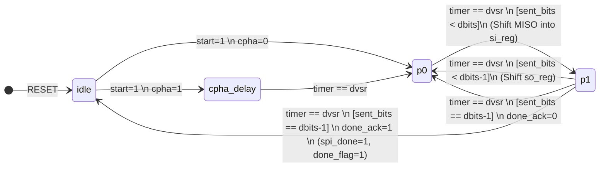
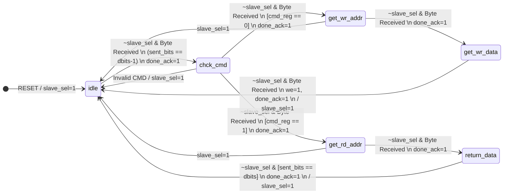

# SPI-Master-with-Two-Slave-RAMs-and-Four-Modes-of-Operation

##  Project Overview
This repository contains a complete RTL implementation of a custom **Serial Peripheral Interface (SPI)** system. The design features a single SPI Master controlling dual Slaves, where each Slave integrates a parameterized Random Access Memory (RAM). 

Going beyond standard SPI protocols, this design introduces a **Custom Handshaking Mechanism** to ensure strict data synchronization, and fully supports all **4 SPI Modes** via dynamic Clock Polarity (CPOL) and Clock Phase (CPHA) configurations.

##  Key Features
* **Full SPI Mode Support:** Supports Modes 0, 1, 2, and 3. The Slave module elegantly handles this using a dual-edge Finite State Machine (FSM) architecture.
* **Multi-Slave Architecture:** 1 Master communicating with 2 independent RAM-integrated Slaves using built-in signal multiplexing.
* **Custom Handshaking Protocol:** Utilizes `done_flag` and `done_ack` signals to prevent data loss and ensure the Master and Slave are perfectly synchronized during byte-level transactions.
* **Integrated Memory Interface:** Slaves interpret a custom 3-byte protocol (Command -> Address -> Data) to perform read/write operations on internal RAM.
* **Highly Parameterized:** Configurable data width (`dbits`) and memory address width (`addr_width`) for easy scalability.
* **Adjustable Clock Divider:** The Master utilizes a divisor input (`dvsr`) to downscale the system clock to the desired `sclk` frequency.

---

##  System Architecture & Protocol

### 3-Byte Communication Protocol
To interact with the Slave's internal memory, the Master sends data in a 3-byte sequence:
1. **Command Byte:** Determines the operation type (`0` for Write, `1` for Read).
2. **Address Byte:** Specifies the target RAM address (`addr_width`).
3. **Data Byte:** * **Write Operation:** Master sends data on `MOSI`. Slave writes it to RAM.
   * **Read Operation:** Slave transmits the requested data back to the Master on `MISO`.

---

##  Module Breakdown & Signal Description

### 1. `spi_top` (System Wrapper)
Integrates the Master and both Slaves, utilizing ternary operator multiplexing to route `MISO` and `done_ack` signals based on the active Chip Select (`cs0` / `cs1`).

| Global Signal | Direction | Description |
| :--- | :---: | :--- |
| `clk`, `reset` | Input | System clock and active-low asynchronous reset. |
| `din` | Input | Parallel data to be transmitted by the Master. |
| `dvsr` | Input | Clock divisor value to generate the SPI `sclk`. |
| `cpol`, `cpha` | Input | Clock Polarity and Phase settings for SPI mode selection. |
| `start` | Input | Trigger signal to initiate SPI transmission. |
| `slave_sel` | Input | Selects the active Slave (`0` for Slave 2, `1` for Slave 1). |
| `master_received_data`| Output | Parallel data received by the Master from the active Slave. |
| `spi_done` | Output | Pulses high when a full SPI transaction is complete. |
| `written_data_x` | Output | (Debug/Monitor) Data successfully written to Slave X's RAM. |
| `written_addr_x` | Output | (Debug/Monitor) Address used for the write operation in Slave X. |
| `read_addr_x` | Output | (Debug/Monitor) Address used for the read operation in Slave X. |

### 2. `spi_master`
The control hub of the system. It handles parallel-to-serial conversion, clock generation, and handshake verification.

| Internal Signal | Direction | Description |
| :--- | :---: | :--- |
| `sclk` | Output | Generated Serial Clock for the SPI bus. |
| `mosi` | Output | Master Out Slave In (Serial Data Line). |
| `cs0`, `cs1` | Output | Active-high Chip Select signals for Slave 1 and Slave 2. |
| `ready` | Output | Indicates the Master is idle and ready for a new `start` command. |
| `done_flag` | Output | Sent to Slave to indicate a byte transmission is complete. |
| `done_ack` | Input | Received from Slave to acknowledge readiness for the next step. |

### 3. `spi_ram_slave`
An advanced SPI Slave featuring an internal SRAM block and dual FSMs (Positive-edge and Negative-edge) to seamlessly adapt to the Master's CPOL/CPHA settings.

| Internal Signal | Direction | Description |
| :--- | :---: | :--- |
| `miso` | Output | Master In Slave Out (Serial Data Line). |
| `spi_done_tick` | Input | Synchronized with the Master's `spi_done`. |
| `we` (Internal) | Logic | Write Enable signal for the internal RAM array. |
| `mem` (Internal)| Memory| $2^{addr\_width} \times dbits$ internal RAM array. |

---

## 🛠️ State Machine Overviews
* **Master FSM:** Transitions through `idle` $\rightarrow$ `cpha_delay` (if applicable) $\rightarrow$ `p0` $\rightarrow$ `p1`. It accurately manages bit-shifting and clock edge generation based on the `dvsr` timer.
* **Slave FSM:** Implements a command execution pipeline: `idle` $\rightarrow$ `chck_cmd` $\rightarrow$ `get_rd_addr` / `get_wr_addr` $\rightarrow$ `return_data` / `get_wr_data`. Employs a smart MUXing strategy between `state_reg_pos` and `state_reg_neg` depending on the `cpol == cpha` condition.

### SPI Master Finite State Machine (FSM)
The following diagram perfectly illustrates the transition flow of the SPI Master FSM:

### SPI Slave Finite State Machine (FSM)
The following diagram perfectly illustrates the transition flow of the SPI RAM Slave FSM, executing the custom 3-byte protocol:

##  Simulation & Verification (Testbench)

A comprehensive testbench (`spi_top_tb.v`) is included to verify the robustness of the design and ensure absolute compliance with the SPI protocol across all modes. 

### Verification Strategy
The testbench validates the system by performing sequential **Write** and **Read** operations targeting specific addresses inside both internal RAMs. The verification covers the following scenarios:

* **System Clock & Baud Rate:** Generates a 100MHz system clock (`10ns` period) and sets the clock divisor (`dvsr = 49`) to correctly synthesize the slower SPI `SCLK`.
* **Exhaustive Mode Testing:** * **Mode 0 (`CPOL=0`, `CPHA=0`):** Writes data `0x3F` to Address `0x03` in RAM 1, followed by a read operation to verify.
  * **Mode 1 (`CPOL=0`, `CPHA=1`):** Writes data `0xAB` to Address `0x04` in RAM 2, followed by a read operation.
  * **Mode 2 (`CPOL=1`, `CPHA=0`):** Writes data `0xCD` to Address `0x0A` in RAM 1, followed by a read operation.
  * **Mode 3 (`CPOL=1`, `CPHA=1`):** Writes data `0x8F` to Address `0x0D` in RAM 2, followed by a read operation.
* **Multiplexing Verification:** Toggling the `slave_sel` signal accurately verifies that the Top Module successfully multiplexes the `MISO` and `done_ack` signals without any data collision between the two Slaves.

